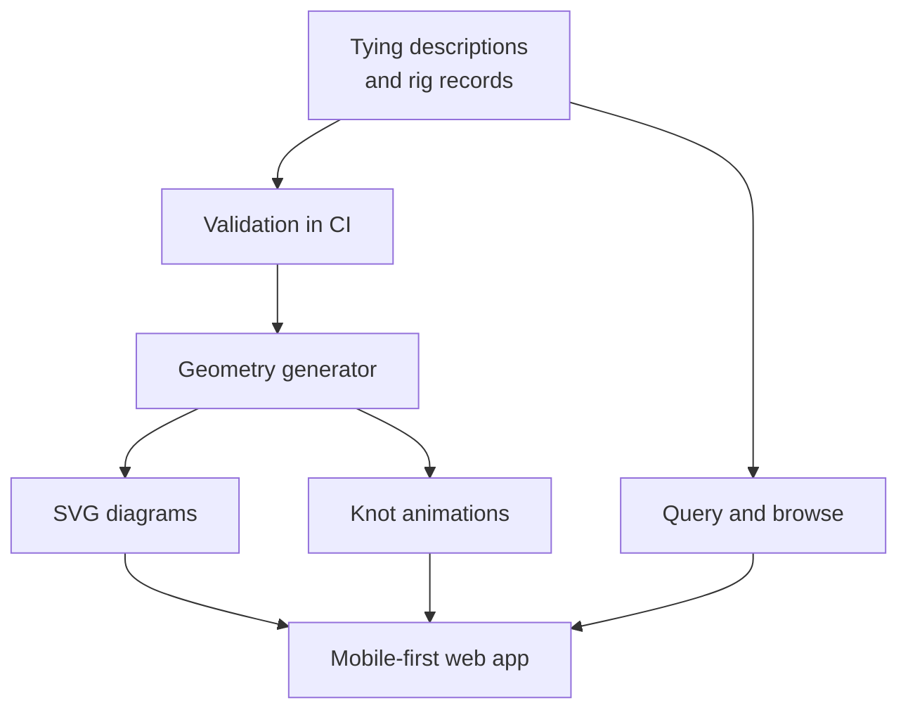

# riggermortis

A mobile-first, open reference for every way a recreational angler can rig terminal tackle: how to tie it, what it's for, and how to fish it.

Rigs and knots are stored as **structured data** and the diagrams are **generated from that data**.

> **Status: research phase.**
> No application code yet.
> The [research](docs/research/) is done, the data model is next, and no pixel gets drawn until the schema and the correctness story are settled.

## The bet

Not "vector instead of photos." That already exists.

The incumbents were measured, not assumed. [Animated Knots](https://www.animatedknots.com) is a JPEG flipbook: one `` element whose `src` is swapped by hand-rolled JavaScript, roughly 13 to 19 hand-shot photographs per knot, with the left/right-handed toggle implemented as a CSS mirror on a bitmap. netknots ships genuine vector animation, but it is an Adobe Animate export running on CreateJS at 12fps in a hard-coded 440x440 box, authored by hand in a discontinued GUI tool.

The real distinction is upstream of the rendering:

> Every project that renders a recognizable practical knot uses **hand-authored splines**.
> Every project that *generates* geometry works on **mathematical knots or pure physics**.
> Nobody generates a practical knot animation from a **structured tying description**.

That sentence is the entire project.
A rig is not a picture of a rig, it is an ordered list of components along a line.
A knot is not a photo sequence, it is a sequence of tying actions.
The diagram, the animation, the search index and the recommendation layer are all projections of that data.



## What the research found

The full reports live in [`docs/research/`](docs/research/) with citations.
The load-bearing conclusions:

**There is no dataset. Anywhere.**
A GitHub code search for `carolina rig` across a million-plus public repositories returns zero results.
So does `"palomar"` in JSON.
Kaggle has nothing, the FAO data catalogue has nothing, and every "fishing dataset" that surfaces is about fish or commercial fleets rather than tackle.
GitHub's `topic:knots` is seven repositories, all mathematical knot theory.
This project would be the primary source, which is both the reason to build it and its entire cost.

**The unmet need is findability, not depiction.**
Anglers do not complain that diagrams look bad.
They complain that the information is unsortable: "YouTube has basically all your answers but it'll be tedious to sort through."
Structure is the product.

**A notation for tying methods already exists.**
[Peter Suber's Knot Tying Notation](https://legacy.earlham.edu/~peters/knotting/notate.htm) encodes methods of tying rather than tied structures.
It separates the running part from the standing part, groups actions into stages that map one-to-one onto animation keyframes, and can wrap a named external object, which is exactly the primitive a knot tied through a hook eye requires.

**Knot theory is the wrong foundation.**
Knotoids are the mathematically honest treatment of an open curve, but a knotoid is a single immersed interval with no second object, so tying around a hook eye breaks the formalism outright and a bend joining two lines is a tangle rather than a knotoid.
None of it expresses friction, dressing, or tightening order, which is most of what a fishing knot actually is.
Topology stays as an optional validation fingerprint, never as the model.

**Content is the binding constraint, not code.**
Wired2Fish has paid staff and reached roughly 30 to 40 rig articles.
The engineering here is the easy part.

## Correctness posture

The project exists to answer a specific question: *how do we know a rig is right, instead of just believing it is?*

The honest answer is that correctness splits into three tiers, and every claim records which tier it earned.

### Tier A: provable, enforced in CI

- Diagram well-formedness. A crossing code either does or does not describe a realizable planar diagram.
- Unknot detection. Regina's Burton-Ozlen recognizer decides this exactly, so "we drew something that falls apart" is a test failure rather than an opinion.
- Regression on identity. Invariants are snapshotted and diffed, so an edit that silently turns one knot into a different knot fails the build. Jones detects handedness flips; Alexander is blind to chirality and cannot be relied on alone.
- Rig graph integrity. Connectivity, absence of orphan subgraphs, ordering acyclicity, and referential integrity.
- The sliding weight with nothing to stop it. This is decidable as an interval-bounds check, not a heuristic.

### Tier B: heuristic, machine-enforced from human tables

- Knot to line-type compatibility, dimensional fit, and component pass-over rules.
- Relative stability ranking via the combinatorial counting rules from Patil et al.
- Duplicate and alias detection through invariant matching.

### Tier C: citation or human expert only

- Breaking strength. See below, the published data does not support anything stronger.
- Dressing and setting technique, fitness for purpose, legality, and nomenclature.
- **Whether the written tying instructions actually produce the encoded knot.** This is the largest silent gap in the project. Software can prove the encoded knot is the knot we claim; it cannot prove a human following our steps arrives there. That gap closes with review by people who fish, and nothing else.

### On knot strength numbers

The project will not publish breaking-strength percentages as fact.
Evans' 2016 meta-analysis covered 114 sources and more than 1,440 tests, and found that the single most common sample size was **n=1**, across 383 of those tests.
Reported residual strengths span 45 to 85 percent with per-knot ranges that overlap each other, wet-versus-dry shows no consistent pattern, and the analysis explicitly excluded fishing line.
There is no peer-reviewed methodology literature for fishing knots, and the popular knot tests are not rigorous.
Any strength claim here is attributed to its source, with its sample size shown.

## Validating rigs: a rig is a netlist

The closest solved analogue is not chemistry or CAD, it is **electronic design rule checking**.
A rig is a netlist of parts with typed pins, so the KiCad electrical-rules model ports over almost directly: a pin-type conflict matrix, an error/warning/ignore severity model, and a culture of explicit waivers for the legitimate exceptions.
Slider components additionally need degree-of-freedom reasoning borrowed from CAD assembly constraints.

RDKit contributes a lesson rather than machinery: a structure that sanitizes cleanly is still not necessarily correct.

## Provenance

Claims that cannot be machine-checked are recorded with per-field provenance, following patterns that already work at scale:

- Statement-level references and ranks, after Wikidata. A claim later found wrong is **demoted, never deleted**, and carries the reason for its deprecation.
- Verifiability applied per field, after OpenStreetMap.
- An accepted-name and synonym model for the regional naming chaos, after GBIF.

Sources in this domain disagree constantly, especially across regions.
That disagreement is a first-class field, not a bug to be flattened.

## Legal position

Rig topology is a method of operation, which 17 USC 102(b) excludes from copyright.
Learning how a rig is assembled from a copyrighted guide is therefore fine; reproducing that guide's diagram or prose is not.
The working rule is **read everything, cite everything, draw everything ourselves, copy nothing**.

Specific findings that overturn common assumptions:

- **The Ashley Book of Knots is not public domain.** Its renewal is on record (`© 21Jul44; A181853. Sarah R. Delano (W); 2Aug71; R510678`), placing it in copyright until 2040. ABoK reference numbers may be cited; the text and illustrations may not be touched.
- **Federal funding is not federal authorship.** 17 USC 105 covers works by government employees, and NOAA's own policy confirms grantees may hold copyright. Sea Grant programs are university grantees, so their publications are presumptively copyrighted.
- **Sport Fish Restoration money does not place state curricula in the public domain.**
- **animatedknots.com is all-rights-reserved and actively enforced.** Treat it as radioactive.

## Open decisions

Tracked as ADRs in [`adr/`](adr/) as they are settled.

- **Licensing.** Code and data need separate licenses, and the data license decides whether the dataset stays open. Deliberately unlicensed until chosen, so treat this repository as all-rights-reserved for now.
- **Notation.** Whether to adopt, adapt, or merely take inspiration from Suber's notation, which carries a bare copyright notice and no license grant.
- **Validation runtime.** No production knot library exists in JavaScript, Rust, or Go. Regina is the strongest tool but ships as a container or conda dependency; `pyknotid` is MIT and pip-installable but has been unmaintained since 2018. CI will likely shell out to a container.
- **Scope boundary.** Freshwater and saltwater conventional tackle is in. Fly fishing is a separate universe and is out for v1.

## Repository layout

```text
riggermortis/
├── adr/              # MADR decision records
├── data/             # Rig, knot, and component records (schema TBD)
└── docs/
    └── research/     # Cited source research behind the decisions above
```

---

Research reports behind every claim above live in [`docs/research/`](docs/research/), with citations.
