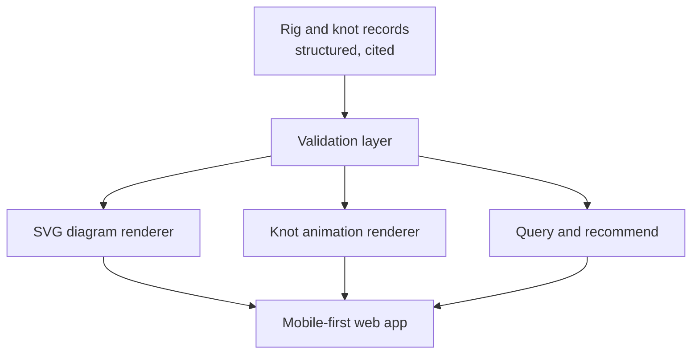

# riggermortis

A mobile-first, open reference for every way a recreational angler can rig terminal tackle: how to tie it, what it's for, and how to fish it.

Rigs and knots are stored as **structured data** and rendered as **animated diagrams generated from that data**.
Not filmed, not AI-generated, not hand-drawn one at a time.

> **Status: research phase.**
> No application code yet.
> We are deliberately settling the data model and the correctness story before drawing a single pixel.

## The bet

Every existing resource in this space is *media*: a video, a photo sequence, an illustration.
Media doesn't compose, can't be queried, can't be validated, and can't be corrected once it's published.

riggermortis treats a rig as data.
A Carolina rig is not a picture of a Carolina rig.
It's an ordered list of components along a line, with metadata about what it's for.
Everything else (the diagram, the animation, the search index, the recommendation engine) is a projection of that data.



Build the components once, and every rig on earth becomes a data file.
Get the schema right and a rig *configurator* falls out for free: render any assembly a user composes, not just the canonical list.

## Why not video, and why not generative AI

Generative video models have no concept of topology.
They do not track which strand passes over which, or where a tag end actually goes.
They will produce a confident, beautiful, **wrong** knot.
Someone will then tie it and lose a fish, or lose something that matters more than a fish.

A knot is a curve in space with a defined crossing sequence.
That is authorable, renderable deterministically, diffable, and testable.
AI belongs in this project's *authoring* and *retrieval* layers, never in its *depiction* layer.

## Two domains, two different truths

This distinction drives the entire architecture.

| | Knots | Rigs |
| --- | --- | --- |
| Nature | Topological object | Convention |
| Ground truth | Mathematical | Community consensus |
| Wrong looks like | Falls apart, or is a different knot | Doesn't catch fish, or is regionally misnamed |
| Validation | Machine-checkable (in part) | Constraint checks plus cited sources |

Treating these the same is how you ship confident nonsense.

## Correctness posture

The project's central question is *"how do we know our rigs are right, instead of just believing they are?"*

The answer is tiered, and the tier is recorded per claim:

1. **Machine-proven.** Computed and enforced in CI.
2. **Constraint-checked.** Heuristics that catch physically impossible or nonsensical assemblies.
3. **Cited.** Traceable to named, independent sources, with disagreement recorded as data rather than resolved silently.
4. **Expert-reviewed.** A human who fishes signed off.

Nothing ships claiming a tier it hasn't earned.
Sources disagree constantly in this domain, especially across regions.
That disagreement is a first-class field, not a bug to be flattened.

## Open decisions

These are unresolved and are being researched now.
They will land as ADRs in [`adr/`](adr/) as they're settled.

- **Licensing.** Code and data need different licenses, and the data license determines whether the dataset stays open. Deliberately unlicensed until decided, so treat this repo as all-rights-reserved for now.
- **Knot encoding format.** Whether an existing notation (Gauss code, PD code) is usable for open working knots tied around an object, or whether we define our own.
- **Component taxonomy.** Whether any standard vocabulary for terminal tackle exists to adopt, or whether we author one.
- **Validation tooling.** Which topological and simulation checks are genuinely practical to run in CI, versus academically real but useless here.
- **Scope boundary.** Freshwater and saltwater conventional tackle is in. Fly fishing is a separate universe and is out for v1.

## Repository layout

```text
riggermortis/
├── adr/              # MADR decision records
├── data/             # Rig, knot, and component records (schema TBD)
└── docs/
    └── research/     # Source research: what data exists, licensing, prior art
```

---

Built by [Nerds Who Fish](https://github.com/NerdsWhoFish).
